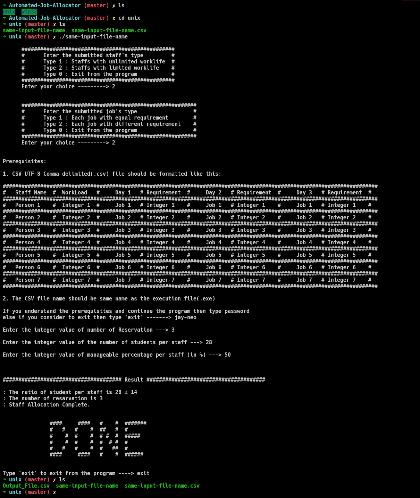
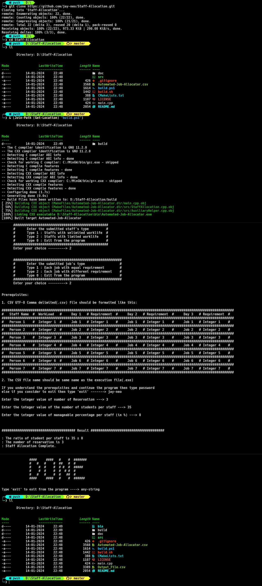

 <div align='center'><h1>Automated Job Allocator</h1></div>

## Problem Statement

Uneven task distribution among staff members is impacting productivity and job satisfaction. The need for an automated system arises to minimize successively assigned tasks for each staff member. The goal is to optimize workforce efficiency while maintaining a fair and equitable task allocation process.

### Constraints

1. Staff members have varying workload capacities
2. Equitable task distribution as Workload Balancing
3. Each job may have varying requirement

Example: Staff Allocation in Examination Rooms


## How to Test the Program

### For Uinx

- Step 1: Clone the repo in your local machine
```sh
git clone https://github.com/jay-neo/Staff-Allocation.git
```

- Step 2: Run two commands in terminal (bash/zsh/fish)
```sh
cd Staff-Allocation
```
```sh
sh build.sh
```

<div align='center'></div>


### For Windows

- Step 1: Clone the repo in your local machine
```sh
git clone https://github.com/jay-neo/Staff-Allocation.git
```

- Step 2: Run two commands in terminal (pwsh)
```sh
cd Staff-Allocation
```
```sh
& (Join-Path (Get-Location) "build.ps1")
```

<div align='center'></div>


## Repository Structure
```
Automated-Job-Allocator
    │
    ├── src/
    │    ├─── AuxiliaryHelper.cpp
    │    ├─── AuxiliaryHelper.h
    │    ├─── StaffAllocation.cpp
    │    └─── StaffAllocation.h
    │
    ├── main.cpp                            # starting point
    ├── CMakeLists.txt                      # cmake file
    │
    ├── build.sh                            # build for unix
    ├── build.ps1                           # build for win32
    │
    └── Automated-Job-Allocator.csv         # This is the input file

```

Old Repository:
[Using freemium libxl with .xlsx file handling](https://github.com/jay-neo/Staff-Allocation-cli)
