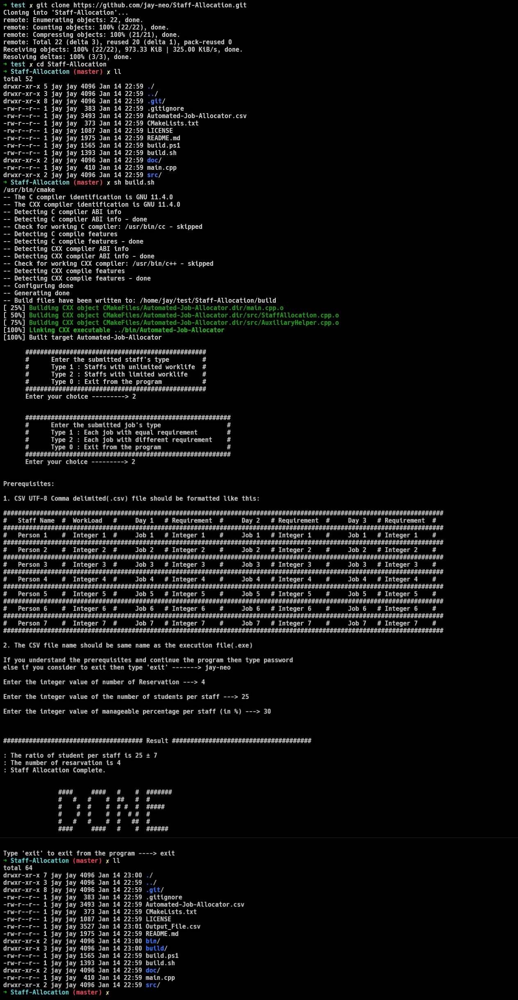

 <div align='center'><h1>Automated Job Allocator</h1></div>

## Problem Statement

Uneven task distribution among staff members is impacting productivity and job satisfaction. The need for an automated system arises to minimize successively assigned tasks for each staff member. The goal is to optimize workforce efficiency while maintaining a fair and equitable task allocation process.

### Constraints

1. Staff members have varying workload capacities
2. Equitable task distribution as Workload Balancing
3. Each job may have varying requirement

Example: Staff Allocation in Examination Rooms


## Testing

### For Uinx

Step 1: Clone the repo in your local machine
```sh
git clone https://github.com/jay-neo/Staff-Allocation.git
```

Step 2: Enter into the repo
```sh
cd Staff-Allocation
```

Step 3: Build the project
```sh
bash build.sh
```

<div align='center'></div>


### For Windows

Prerequisite : [MinGW32](https://sourceforge.net/projects/mingw-w64/files/Toolchains%20targetting%20Win64/Personal%20Builds/mingw-builds/8.1.0/threads-win32/sjlj/x86_64-8.1.0-release-win32-sjlj-rt_v6-rev0.7z/download)


Step 1: Clone the repo in your local machine
```pwsh
git clone https://github.com/jay-neo/Staff-Allocation.git
```

Step 2: Enter into the repo
```pwsh
cd Staff-Allocation
```

Step 3: Build the project
```pwsh
pwsh build.ps1
```
or `& (Join-Path (Get-Location) "build.ps1")`


<div align='center'></div>


## Repository Structure
```
Automated-Job-Allocator
    │
    ├── src/
    │    ├─── AuxiliaryHelper.cpp
    │    ├─── AuxiliaryHelper.h
    │    ├─── StaffAllocation.cpp
    │    └─── StaffAllocation.h
    │
    ├── main.cpp                            # starting point
    ├── CMakeLists.txt                      # cmake file
    │
    ├── build.sh                            # build for unix
    ├── build.ps1                           # build for win32
    │
    └── Automated-Job-Allocator.csv         # This is the input file

```

Old Repository:
[Using freemium libxl with .xlsx file handling](https://github.com/jay-neo/Staff-Allocation-cli)
